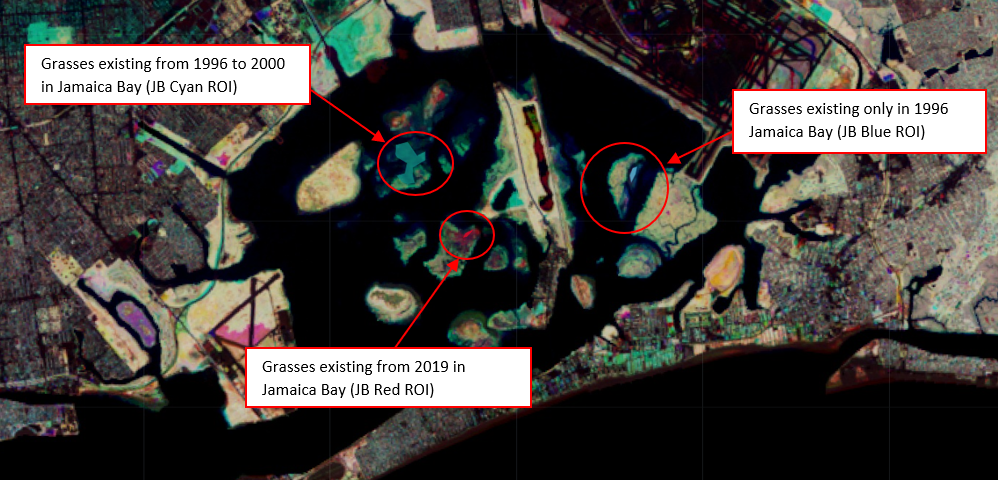
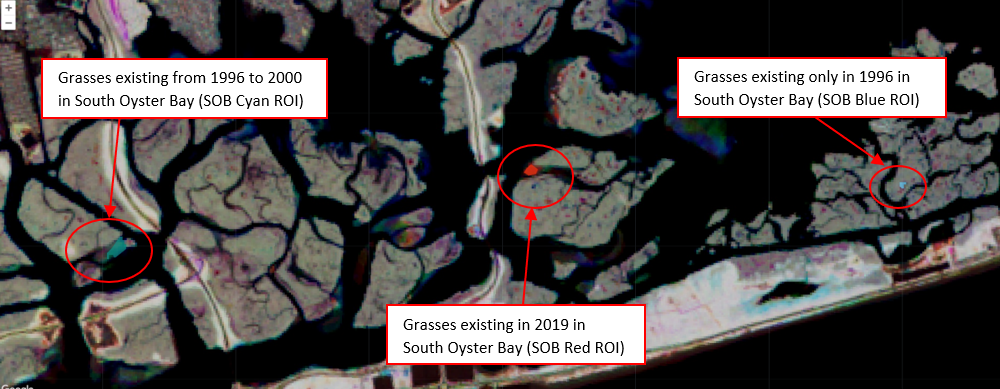
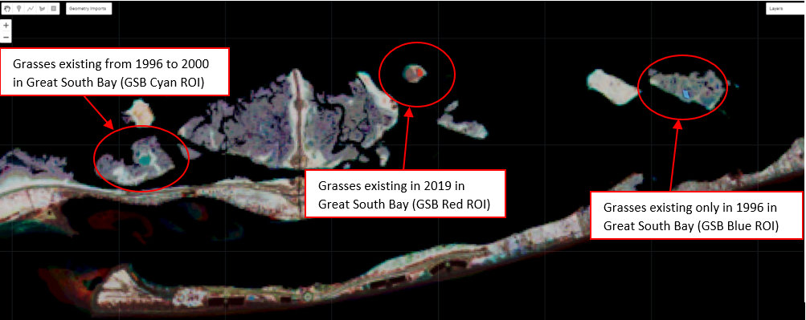

```{css formatting, echo=FALSE}

h1 {
     font-size: 25px;
     font-weight: bold;
     font-family: Helvetica;
     color: #343434;
 }
 h2 {
     font-size: 15px;
     font-weight: bold;
     font-family: Helvetica;
     color: #343434;

 }
```

```{r setup, include = FALSE}
knitr::opts_knit$set("C:/Users/Helen Polanco/OneDrive/Documents/marsh_markdown")
knitr::opts_chunk$set(echo = TRUE)
```

---
knit:  (function(inputFile, encoding) { out_dir <- 'docs'; rmarkdown::render(inputFile, encoding=encoding, output_file=file.path(dirname(inputFile), out_dir, 'index.html')) })
---
## __Introduction:__

___Be sure to toggle the code buttons located on the far right of the page as you read along! you can also download the RMD by clicking the code button at the very top of the page.___  

The analysis demonstrated in this tutorial is part of a [two part study](https://github.com/polanch190/GEE-Spatial-Temporal-Analysis-of-Changes-in-Marsh-Vegetation-Density-/blob/main/Color_composite_Image_NB.ipynb) in which data was initially extracted from satellite imagery in a remote sensing analysis.The initial study hypothesized that the acceleration of sea level rise and increased storm frequency are influencing the disappearance of marsh vegetation in Long Island’s South Shore Estuary. The extracted satellite imagery data will be used to evaluate the relationship between Long Island's vegetation density (NDVI), mean local sea level rise, and storm events frequency over time. Basic statistical tests will be used to evaluate these relationships by doing the following analysis:

1. Normality testing
3. Plotting the data in a dual axis time series plot 
4. Correlation testing using Spearman's Rho 
6. A basic multiple linear regression analysis

## __Background on remote sensing analysis__ {.tabset}

___Click the tabs below to review the results of a remote sensing color image analysis.___ 


Shown below, is the composite satellite image that was created to extract the Long Island vegetation density data used in the statistical analysis in this tutorial. This single color image is composed of three normalized difference vegetation index images (NDVI) created in the initial study.This color image displays the vegetation density in an area for a given year. Specifically,each primary color represents a single year containing vegetation. A secondary color represents the presences of vegetation throughout multiple years. For example red spots show where vegetation only grew in 2019, blue spots show only where vegetation grew in 1995, and cyan spots show only where vegetation grew through out the years 1995 and 2000.

For more information on the methods and out come of the entire study feel free to read the [executive study](https://github.com/polanch190/GEE-Spatial-Temporal-Analysis-of-Changes-in-Marsh-Vegetation-Density-/blob/main/ThesisExecutiveSummary_UpdatedAnalysis.pdf).


### __Jamaica Bay Color Image__
```{r, echo=FALSE, out.width='100%', include=TRUE}

```

### __South Oyster Bay Color Image__
```{r, echo=FALSE, out.width='100%', include=TRUE}

```

### __Great South Bay Color Image__
```{r, echo=FALSE, out.width='100%', include=TRUE}

```


## __About the data__

The storm event data used in this tutorial are available on [NOAA's storm event database](https://www.ncdc.noaa.gov/stormevents/ftp.jsp). Mean Local see level rise data can be found on 
[NOAA's tides and currents webpage](https://tidesandcurrents.noaa.gov/sltrends/sltrends_station.shtml?id=8518750).The NDVI data used in this tutorial was extracted from satellite imagery. Satellite imagery data are accessible on [Google Earth Engine's data catalog](https://developers.google.com/earth-engine/datasets/catalog/landsat).To learn how to use Google Earth Engine's python api to extract NDVI data from satellite images please visit [this](https://github.com/polanch190/GEE-Spatial-Temporal-Analysis-of-Changes-in-Marsh-Vegetation-Density-/blob/main/Color_composite_Image_NB.ipynb) tutorial. 


## __Reading in libraries and organizing data__

Let's begin our analysis with reading in some necessary libraries as well as reading in and organizing mean local sea level rise (MLSLR) data.
```{r class.source = 'fold-show', echo=TRUE, message=FALSE, include=TRUE}
library(tidyverse)
library(lubridate)
library(janitor)
library(readr)
library(ggplot2)
library(hrbrthemes)
library(tidyquant)

meanL_SLR <-read_csv("TheBattery_meanSLtrend_trim2.csv")
#organize and clean MLSLR data
meanL_SLR<- clean_names(meanL_SLR)
meanL_SLR<- rename(meanL_SLR, month = slr_month)
```

Now lets read in the NDVI (satellite obtained vegetation density data) and organize it. Data from nine region of interests (ROI sites) were extracted from the color image in GEE. Therefore, we will need to read in nine CSV file. To read the files in more efficiently, a function that reads in all files and merges them all into one data frame will be created. The date column will then be converted to yyyy-mm-dd and the year, month and day will be extracted from the new date column to a new columns.  
```{r, class.source = 'fold-show', echo=TRUE, include=TRUE, message= FALSE}

multi_merge2 = function(mypath){
  filenames=list.files(path=mypath,full.names=TRUE)
  datalist = lapply(filenames, read_csv)
  Reduce(full_join, datalist)}

NDVI_data <- multi_merge2("SR_timeseries_Final")

#organize/ clean/ reclassify and rename columns NDVI the data

NDVI_data <- clean_names(NDVI_data)

NDVI_data <- rename(NDVI_data, date = system_time_start)

NDVI_data$date<- lubridate::mdy(NDVI_data$date) 

NDVI_data <- NDVI_data %>%
  dplyr::mutate(year = lubridate::year(date),
                month = lubridate::month(date),
                day = lubridate::day(date))

```

## __Data exploration and normality testing__ {.tabset} 

Now let's inspect the data. Note how there are 26 observations in the MLSLR data and there are 72 observation in the NDVI data.

```{r,class.source = 'fold-show',echo=TRUE, include=TRUE}
length(!is.na(meanL_SLR$monthly_msl)) 

length(!is.na(NDVI_data$gsb95_ndvi))
```

Before we run normality testing on the MLSLR and NDVI data, we will join the data together. This is because we want to correctly assess the distribution of all the data to choose the correct correlation test when analyzing for the relationship between vegetation density and MLSLR. Normality testing can be conducted using the Wilk Shapiro test. We can analyze the normality of the NDVI data for each ROI site and visualize the data in a histogram one by one as shown below.   

```{r,class.source = 'fold-show',echo=TRUE, include=TRUE}
NDVI_ML_SLR <- NDVI_data %>%
  left_join(meanL_SLR,
            by = c("year" = "year", "month" = "month")) %>%
  arrange(year)
```
___Click the tabs below to see the results of the normality test.___

### __Plot___
```{r}
hist(NDVI_ML_SLR$gsb_95_00_ndvi, 
     main ="Histogram of Vegetation Density Values (NDVI) in Great South bay 1995",
     xlab = "NDVI values",
     ylab = "Frequency")

```

### __Result Summary Values__
```{r}
shapiro.test(NDVI_ML_SLR$gsb_95_00_ndvi) #meanL_SLR$monthly_msl
```

### __Table__
```{r}
NDVI_ML_SLR
```

HOWEVER, this would take along time. Instead we will organize the data so that we can loop the test over the data set. Our current table has some columns that we don't want to apply the shapiro test on. To fix this, we will create a new variable and drop the columns we don't want from the original table then apply the shapiro test to the new table. Then we will have a list of test results showing how some data are skewed.

```{r, echo=TRUE, include=TRUE}

Normallity_tests <- NDVI_ML_SLR %>%
  select(c(jb19_ndvi,jb_95_00_ndvi, jb95_ndvi))%>%
  apply(2,shapiro.test)

Normallity_tests 

```


## __Correlation between NDVI and MLSLR__ {.tabset}

As we saw, some of the data in the data frame are not normally distributed. We can choose Spearman's Rho because it is a robust analysis and doesn't require normally distributed data. We can now create a function that will loop over the data set and run the correlation test. 


Lets begin the process by subsetting the data using the select function. This will remove any columns you don't need to include in your correlation. In this section we will create a function that compares mean local sea level rise data (y) to all x's (other_var) by using the apply function to run Spearman's Rho over all the data.

### __Code__
```{r, class.source = 'fold-show' ,echo=TRUE, include=TRUE, warning=FALSE, error=FALSE, results='hide'}
SubNDVI_mlsr <- NDVI_ML_SLR %>%
  select(c(gsb_95_00_ndvi, gsb95_ndvi, monthly_msl))

cor_test_loop <- function(data, y) {
  return(apply(
    data,
    2,
    FUN = function (other_var) {
      return(cor.test(other_var, data[[y]], data = data, method = "spearman"))
    }
  ))
}

#cor_test_loop(SubNDVI_mlsr,"monthly_msl")

```

### __Result Summary Values__
```{r, echo=TRUE, include=TRUE, warning=FALSE, error=FALSE}
cor_test_loop(SubNDVI_mlsr,"monthly_msl")

```


## __Plotting NDVI vs MLSLR__ {.tabset}

The correlation analysis reveled that there is a relationship between the vegetation density (NDVI values) in Queens, Long Island South Bay, and MLSLR. In this section we will see if the vegetation in each location has kept growing over time despite the rise in sea level. To show this, we will compare the NDVI values to MLSLR data by creating a dual axis box plot and line graph time series analysis.This will help us visualize the correlation results. To start, lets take the joined NDVI and MLSLR data frame and make it long. 


```{r,echo=TRUE, include=TRUE, class.source = 'fold-show'}

NDVI_ML_SLR_long <- NDVI_ML_SLR  %>%
  pivot_longer(cols = contains("ndvi"),
               names_to = "roi_marsh",
               values_to = "NDVI_val")%>%
  filter(!is.na("roi_marsh")&
           !is.na("NDVI_val"))
```

___To see the code for the plots select the code button on your right.___

### __Boxplot 1__
Plot of vegetation that grew in the blue sites on the map in 1995 blue site. 
```{r, echo= TRUE, collapse = TRUE, include=TRUE,warning=FALSE, error=FALSE, message=FALSE,fig.height = 10, fig.width = 8}

# Create custom colors for your boxplot graph

ndvicolor <- "#17c1d4"
MLSLRcolor <- "#d49817"
ndviTXTcolor95 <- "#0c5970"
MLSLRtxtColor95 <- "#4f280a"

# New facet label names for dose variable
roi_marsh.labs <- c("Great South Bay", "Jamaica Bay", "South Oyster Bay")
names(roi_marsh.labs) <- c("gsb95_ndvi", "jb95_ndvi", "sob95_ndvi")


##Create boxplots of Blue NDVI data distribution V.S. Mean Local Sea Level Rise


MLSLR_NDVI_95_bp <- NDVI_ML_SLR_long %>%
  filter(roi_marsh %in% c("jb95_ndvi", "sob95_ndvi", "gsb95_ndvi")) %>%
  ggplot(aes(x = year)) +
  geom_boxplot(aes(y = NDVI_val, group = year),
               size = 1,
               color = ndvicolor) +
  geom_line(aes(y = monthly_msl), size = 1.5, color = MLSLRcolor) +
  scale_y_continuous(# Features of the first axis
    name = "NDVI Values from Marshes Exsisting in 1995",
    
    # Add a second axis and specify its features
    sec.axis = sec_axis(trans =  ~ . * 1, name = "Mean Local SLR")) +
  ggtitle("Mean Local SLR Compared to NDVI Times Series") +
  theme_test(
    base_size = 15,
    base_family = "",
    base_rect_size = 0.5
  ) + #this changes the text size of the numbers on the xy scale and the facet names
  theme(
    strip.text = element_text(size = 10, face = "bold"),
    axis.title.y = element_text(
      color = ndviTXTcolor95 ,
      size = 13,
      margin = margin(
        t = 5,
        r = 10,
        b = 10,
        l = 10
      )
    ),
    axis.title.y.right = element_text(size = 13,
      color = MLSLRtxtColor95 ,
      margin = margin(
        t = 5,
        r = 10,
        b = 10,
        l = 10
      )
    ),
    axis.title.x = element_text(size = 13, margin = margin(
      t = 5,
      r = 10,
      b = 10,
      l = 10
    )),
    plot.title = element_text(size = 15, margin = margin(
      t = 5,
      r = 10,
      b = 10,
      l = 10
    ))
  ) +
  facet_wrap( ~ roi_marsh,
              labeller = labeller(roi_marsh = roi_marsh.labs),
              nrow = 3)

MLSLR_NDVI_95_bp
```

### __Boxplot 2__

Plot of vegetation that grew in the cyan sites through out the years 1995 to 2000.Click the code button to see how to change the colors and variable names
``````{r, echo= TRUE, include = TRUE,collapse = TRUE, warning=FALSE, error=FALSE, message=FALSE,fig.height = 10, fig.width = 8}
ndvicolor <- "#008080"
MLSLRcolor <- "#d49817"
ndviTXTcolor95_00 <- "#1e3321"
MLSLRtxtColor95_00 <- "#4f280a"

# New facet label names for dose variable
roi_marsh.labs2 <-
  c("Great South Bay", "Jamaica Bay", "South Oyster Bay")
names(roi_marsh.labs2) <-
  c("gsb_95_00_ndvi", "jb_95_00_ndvi", "sob_95_00_ndvi")

#filter and plot
MLSLR_NDVI_95_00_bp <- NDVI_ML_SLR_long %>%
  filter(roi_marsh %in% c("gsb_95_00_ndvi", "jb_95_00_ndvi", "sob_95_00_ndvi")) %>%
  ggplot(aes(x = year)) +
  geom_boxplot(aes(y = NDVI_val, group = year),
               size = 1,
               color = ndvicolor) +
  geom_line(aes(y = monthly_msl), size = 1.5, color = MLSLRcolor) +
  scale_y_continuous(
    name = "NDVI Values from Marshes Exsisting in 1995 to 2000",
    sec.axis = sec_axis(trans =  ~ . * 1, name = "Mean Local SLR")) +
  ggtitle("Mean Local SLR Compared to NDVI Times Series") +
  theme_test(
    base_size = 15,
    base_family = "",
    base_rect_size = 0.5
  ) + 
  theme(
    strip.text = element_text(size = 10, face = "bold"),
    axis.title.y = element_text(
      color = ndviTXTcolor95_00 ,
      size = 13,
      margin = margin(
        t = 5,
        r = 10,
        b = 10,
        l = 10
      )
    ),
    axis.title.y.right = element_text(
      size = 13,
      color = MLSLRtxtColor95_00 ,
      margin = margin(
        t = 5,
        r = 10,
        b = 10,
        l = 10
      )
    ),
    axis.title.x = element_text(size = 13, margin = margin(
      t = 5,
      r = 10,
      b = 10,
      l = 10
    )),
    plot.title = element_text(size = 15, margin = margin(
      t = 5,
      r = 10,
      b = 10,
      l = 10
    ))
  ) +
  facet_wrap( ~ roi_marsh,
              labeller = labeller(roi_marsh = roi_marsh.labs2),
              nrow = 3)

MLSLR_NDVI_95_00_bp
```

### __Boxplot 3__
Plot of vegetation that grew in the red sites in 2019. Click the code button to see how to change the colors and variable names.
```{r, echo= TRUE, include = TRUE,collapse = TRUE, warning=FALSE, error=FALSE, message=FALSE,fig.height = 10, fig.width = 8}
ndvicolor19 <- "#d11e0a"
MLSLRcolor19 <- "#d49817"
ndviTXTcolor19 <- "#6b1207"
MLSLRtxtColor19 <- "#4f280a"


# New facet label names for dose variable
roi_marsh.labs3 <- c("Great South Bay", "Jamaica Bay", "South Oyster Bay")
names(roi_marsh.labs3) <- c("gsb19_ndvi", "jb19_ndvi", "sob19_ndvi")


# Create boxplots of Red NDVI distribution V.S. Sea Level Rise 

MLSLR_NDVI_19_bp <- NDVI_ML_SLR_long %>%
  filter(roi_marsh %in% c("gsb19_ndvi", "jb19_ndvi", "sob19_ndvi")) %>%
  ggplot(aes(x = year)) +
  geom_boxplot(aes(y = NDVI_val, group = year),
               size = 1,
               color = ndviTXTcolor19) +
  geom_line(aes(y = monthly_msl), size = 1.5, color = MLSLRcolor) + # Divide by 10 to
  scale_y_continuous(name = "NDVI Values from Marshes Exsisting in 2019",
                     sec.axis = sec_axis(trans =  ~ . * 1, name = "Mean Local SLR")) +
  ggtitle("Mean Local SLR Compared to NDVI Times Series") +
  theme_test(
    base_size = 15,
    base_family = "",
    base_rect_size = 0.5
  ) +
  theme(
    strip.text = element_text(size = 10, face = "bold"),
    axis.title.y = element_text(
      color = ndviTXTcolor19 ,
      size = 13,
      margin =     margin(
        t = 5,
        r = 10,
        b = 10,
        l = 10
      )
    ),
    axis.title.y.right = element_text(
      size = 13,
      color = MLSLRtxtColor19 ,
      margin = margin(
        t = 5,
        r = 10,
        b = 10,
        l = 10
      )
    ),
    axis.title.x = element_text(size = 13, margin = margin(
      t = 5,
      r = 10,
      b = 10,
      l = 10
    )),
    plot.title = element_text(size = 15, margin = margin(
      t = 5,
      r = 10,
      b = 10,
      l = 10
    ))
  ) +
  facet_wrap( ~ roi_marsh,
              labeller = labeller(roi_marsh = roi_marsh.labs3),
              nrow = 3)
MLSLR_NDVI_19_bp
```

## __Exploring storm frequency data__{.tabset}

The plots show how MLSLR increased overtime as the NDVI data decreased in the blue and cyan ROI sites. These results are consistent with the results of the correlation analysis. However, the last time series plot shows the opposite out come. This indicates that the marshes in the red ROI sites maybe resilient to sea level rise. Still, not all blue and cyan ROI sites had a significant negative correlation between NDVI values and MLSLR. 

In this section we will further look into these sites and investigate the impact of storm frequency on marsh island vegetation. Lets start by reading in some storm frequency data acquired from NOAA's storm event database. Then lets evaluate the frequency of storm events over time in a smoothed time series analysis plot.


```{r,echo=TRUE,inclue =TRUE, warning=FALSE, message=FALSE, class.source = 'fold-show'}
subset_storms <- read.csv("Subset_storm_data.csv") 
subset_storms <-clean_names(subset_storms) 


Stormplot <-  subset_storms%>% 
  filter(event_type_coarse %in% c("Heavy Rain", "Thunderstorm", "Flood"))%>%
  group_by(event_type_coarse, begin_year)%>%
  summarise(freq= n())


```

The plot below shows that there was a high frequency of thunderstorms in 2009 and a high frequency of floods 2011. There also seemed to have been some small storm event peaks in heavy rain and thunderstorms in 1997. With this information we can now continue with a regression analysis to see if the relationship between NDVI and MLSLR changes after adding storm frequency data to the analysis.

___To see the code for the plots select the code button on your right.___

### __Time Series Plot__
```{r,echo=TRUE, include=TRUE,warning=FALSE,error=FALSE,message=FALSE, out.width='100%'}

Stormplot %>%
  ggplot( aes(x=begin_year, y=freq, 
              group=event_type_coarse, 
              color= event_type_coarse)) +
  #geom_line() +
  geom_smooth(se=FALSE, size = 1.5)+
  theme_minimal()+
  theme(plot.title = element_text(size=15),
        plot.subtitle = element_text(size = 13),
        axis.title = element_text(size = 12), 
        axis.text = element_text(size = 10, face="bold"),
        strip.text = element_text(size = 112, face="bold"),
        legend.text = element_text(size = 9),
        legend.title = element_text(size = 9)) +
  geom_vline(xintercept = 2009)+
  geom_vline(xintercept = 2011)+
  geom_vline(xintercept = 1997)+
  labs(colour = "Reported Event Type")+  
  ylab("Number of Reported Storm Events")+
  xlab( "Year")

```

### __Table__
```{r,echo=FALSE,inclue =FALSE, warning=FALSE, message=FALSE}
Stormplot
```


## __NDVI, MLSLR, storm frequency regression analysis__ {.tabset}

When comparing MLSLR data to NDVI values derived from cyan ROI sites specifically in Jamaica bay and South Oyster Bay no significant correlations was found. In this section we will continue with a regression analysis to find out if the frequency of storm events impacts the relationship between vegetation density and MLSLR data. 

First lets read in storm event data that has been joined to both MLSLR and NDVI data. We will then convert the storm data from character to factor and run the linear model function on both site locations. 


```{r,class.source = 'fold-show',echo=TRUE,include=TRUE, message=FALSE}
Storm_SLR_NDVI<- read_csv("Storm_SLR_NDVI_cyan.csv")

Storm_SLR_NDVI$event_type_coarse <- as.factor(Storm_SLR_NDVI$event_type_coarse)
class(Storm_SLR_NDVI$event_type_coarse)
levels(Storm_SLR_NDVI$event_type_coarse)
```

___To see the code for the plots select the code button on your right.___

### __Jamaica Bay Summary Stats__

This summary compares the NDVI values extracted from the Jamaica Bay cyan ROI site to MLSLR and storm event type frequency.
```{r, echo= TRUE,include = TRUE}
MLR_jb_95_00_ndvi <-lm(jb_95_00_ndvi ~ monthly_msl + event_type_coarse, data = Storm_SLR_NDVI)

summary(MLR_jb_95_00_ndvi)
```

### __South Oyster Bay Summary Stats__

This summary compares the NDVI values extracted from the South Oyster Bay cyan ROI site to MLSLR and storm event type frequency.
```{r, echo=TRUE,include=TRUE}
MLR_sob_95_00_ndvi <-lm(sob_95_00_ndvi ~ monthly_msl + event_type_coarse, data = Storm_SLR_NDVI)

summary(MLR_sob_95_00_ndvi)
```


## __Regression analysis discussion__
Notice that both analyses have significant p-values but R-squared values that are < than 0.5. This means that there is no relationship between vegetation density, MLSLR, and storm event type frequency at these specific sites. Other environmental or anthropogenic factors could be impacting the relationship between MLSLR and marsh island vegetation density at specific locations and sites throughout Queens and Long Islands South bay. Still, the analyses conducted through out this notebook show how tidal wetlands are losing vegetation at accelerating rates at other sites through out Long Island and are not keeping up with climate change-derived MLSLR. 


